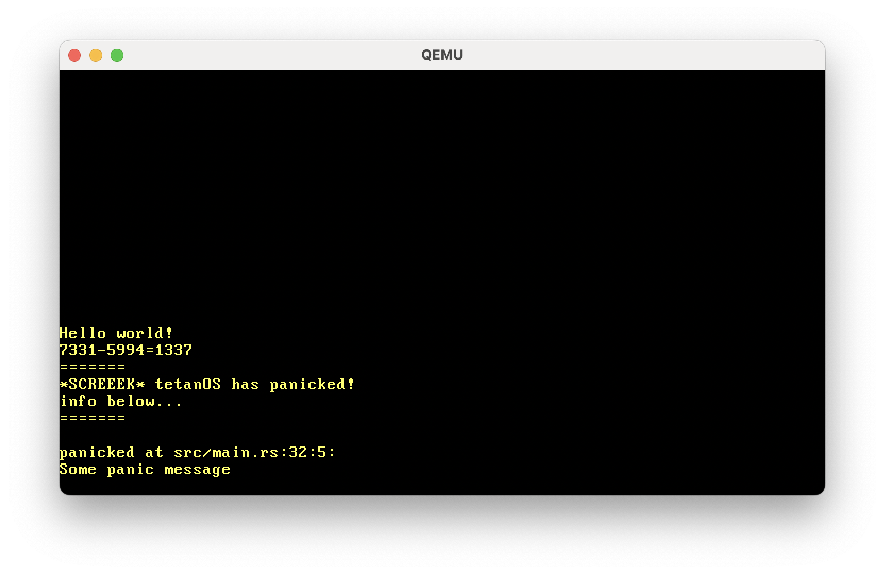
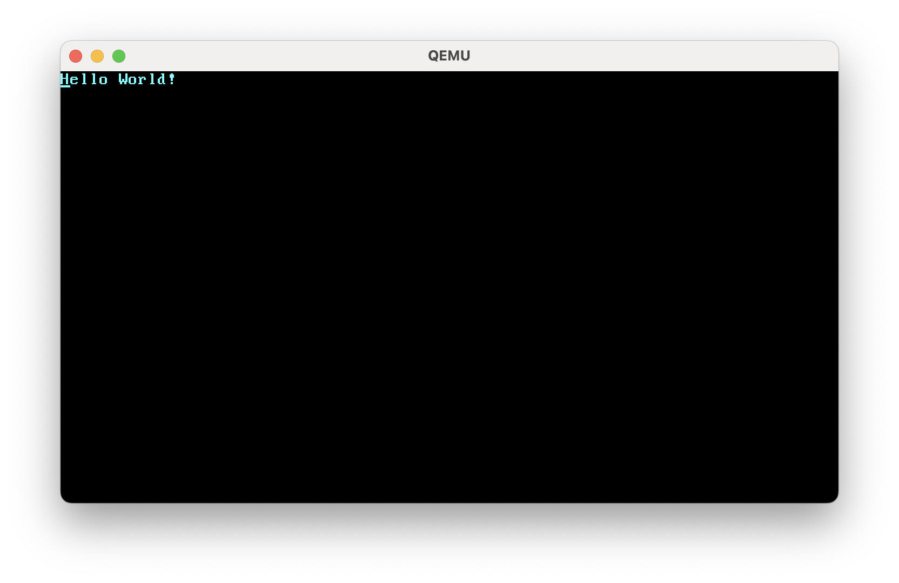

# tetanOS


> _written in Rust, runs on bare metal_

A minimal OS written in Rust. So far, I've mostly been following along with [this series of blog posts](https://os.phil-opp.com/minimal-rust-kernel/). As of yet, the only significant difference this implementation provides is that it's mine. But I've been learning a lot along the way, and that certainly stands for something.

# Progress

Got a VGA buffer implementation up and running, so now we have proper `println!`


So far, I've gotten arbitrary strings writable to the VGA buffer in a bootable disk image


I've decided to go off-piste to the blog post and I implemented (hacky) keyboard polling


# Running

So far...

```bash
cd tetanos
cargo install bootimage
rustup component add rust-src --toolchain nightly-aarch64-apple-darwin
rustup component add llvm-tools-preview
cargo run
```

# License

[it's the GNU GPLv3.](LICENSE)

# credit

Huge thanks to https://os.phil-opp.com/ -- tetanOS is based on it, and I wouldn't be able to do this without this guide.
